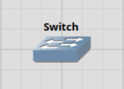
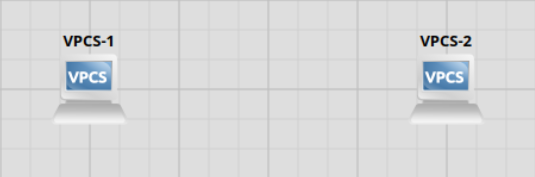
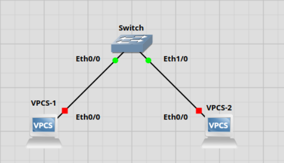
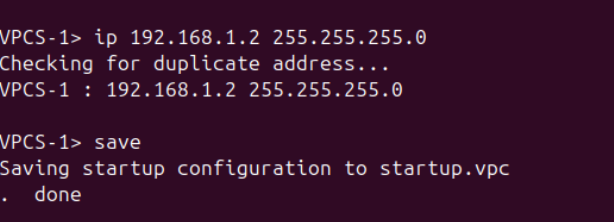
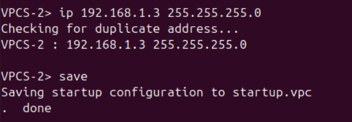
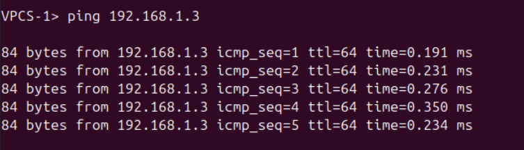

# Lab 0.5 - How To Guide

## 1. Starta GNS3 och skapa ett nytt projekt

- Öppna GNS3 > New Project > Döper projektet till, Lab-0-5

## 2. Skapa en switch (lägg in Switch från Switches / Devices)

-  Dra in "Ethernet Switch" från Switches eller Devices och släpp den i arbetsytan

## 3. Lägg till två VPC-enheter

-  Lägg till två "VPC" från End Devices eller Devices och släpp dem på arbetsytan

##  4. Anslut VPC-enheterna till switchen

- Anslut VPC 1 & 2 till switchen med hjälp av "Ethernet Cable" (Add a link)

##  5. Tilldela IP-adresser till VPC-enheterna

 - VPC1: ip 192.168.1.2 255.255.255.0
 - VPC2: ip 192.168.1.3 255.255.255.0

## 6. Testa kommunikationen:
 Från VPC1, pinga VPC2: ping 192.168.1.3
---

Steg i Bilder:

2. Skapa en switch
 

3.Lägg till två VPC-enheter
 

4. Anslut VPC-enheterna till switchen
 

6. Tilldela IP-adresser till VPC-enheterna
 

 

8. Testa kommunikationen:
 

