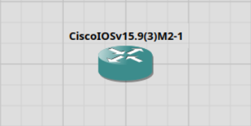
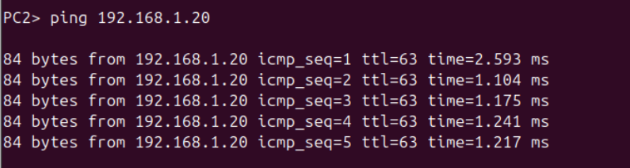

# Lab1-HowTo-Guide

## 1. Starta GNS3 och skapa ett nytt projekt

- Öppna GNS3 > New Project > Döper projektet till, Lab-1

## 2. Ladda ner IOS-avbildningen ”vios-adventerprisek9-m.spa.159-3.m2.qcow2” för att använda med din Cisco IOS-router. 

- För att kunna Lägg till en Cisco IOS router via New Template > Routers > Cisco IOSv


## 3. Skapa det första privata nätverket med IP-adressområdet 10.0.0.x/24.
 - Inom detta nätverk, lägg till en switch och minst två virtuella PC-enheter.

- PC1: ip 10.0.0.10 255.255.255.0 10.0.0.1
- PC2: ip 10.0.0.20 255.255.255.0 10.0.0.1
 
## 4. Skapa det andra privata nätverket med IP-adressområdet 192.168.1.x/24.
- Nätverk två innehåller en switch och minst två virtuella PC-enheter.

- PC3: ip 192.168.1.10 255.255.255.0 192.168.1.1
- PC4: ip 192.168.1.20 255.255.255.0 192.168.1.1

## 5. Koppla ihop routern med switcharna

## 6. Konfigurera routern:
```
enable
configure terminal

interface GigabitEthernet0/0
ip address 10.0.0.1 255.255.255.0
no shutdown
exit

interface GigabitEthernet0/1
ip address 192.168.1.1 255.255.255.0
no shutdown

exit
```

## 7. Testa åtkomsten mellan nätverken. Se till att alla enheter kan kommunicera med varandra.
- Använder ping-kommandot från PC-enheter i ett nätverk till PC-enheter i det andra nätverket.

- PC1 ping PC3: ping 192.168.1.10
- PC2 ping PC3: ping 192.168.1.10

- PC1 ping PC3: ping 192.168.1.20
- PC2 ping PC4: ping 192.168.1.20

### 4. Ge nätverket på 192.168.1.x/24 Internetåtkomst med NAT

Börja med att koppla om alla anslutningar till portar från routern. 

Man kan aven ta bort den och sätta dit en ny, + bytter namn till router. Anledningen är att configrationen jag använder nu är annorluna än åvan.

G0/0 till Nat molnet

G0/1 till nätverk 2 - Switch2 0
G0/2 till nätverk 1 - Switch1 port 0

Router kommando:
```
enable
configure terminal

interface GigabitEthernet0/0
ip address 192.168.122.2 255.255.255.0
no shutdown
exit

interface GigabitEthernet0/1
ip address 192.168.1.1 255.255.255.0
no shutdown
exit

```


NAT kommandon:
```
access-list 1 permit 192.168.1.0 0.0.0.255
ip nat inside source list 1 interface GigabitEther 0/0 overload

interface GigabitEther 0/0
ip nat outside
exit

interface GigabitEther 0/1
ip nat inside
exit

ip route 0.0.0.0 0.0.0..0 192.168.122.1
```
---

Steg i Bilder:

2. Lägg till  Cisco IOS router


3. Säter ihop nätverket ett


PC1:
<br>


PC2:
<br>


4. Säter ihop nätverket två


PC3:
<br>


PC4:
<br>


5. Koppla ihop Nätverken


6. Konfigureringen

- interface GigabitEthernet0/0


- interface GigabitEthernet0/1


7. De olika pingen testerna
- PC1 ping PC3:


- PC2 ping PC3:


- PC1 ping PC4:


- PC2 ping PC4:

