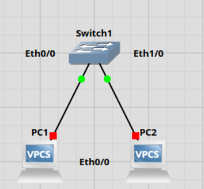

# Lab1-HowTo-Guide

## 1. Starta GNS3 och skapa ett nytt projekt

- Öppna GNS3 > New Project > Döper projektet till, Lab-1

## 2. Ladda ner IOS-avbildningen ”vios-adventerprisek9-m.spa.159-3.m2.qcow2” för att använda med din Cisco IOS-router. 

- För att kunna Lägg till en Cisco IOS router via New Template > Routers > Cisco IOSv

## 3. Skapa det första privata nätverket med IP-adressområdet 10.0.0.x/24.
 - Inom detta nätverk, lägg till en switch och minst två virtuella PC-enheter.

---

Steg i Bilder:

2. Lägg till  Cisco IOS router

3. Säter ihop nätverket ett

